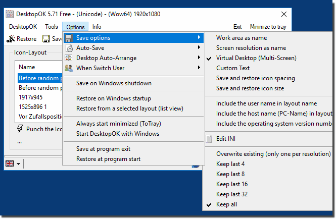
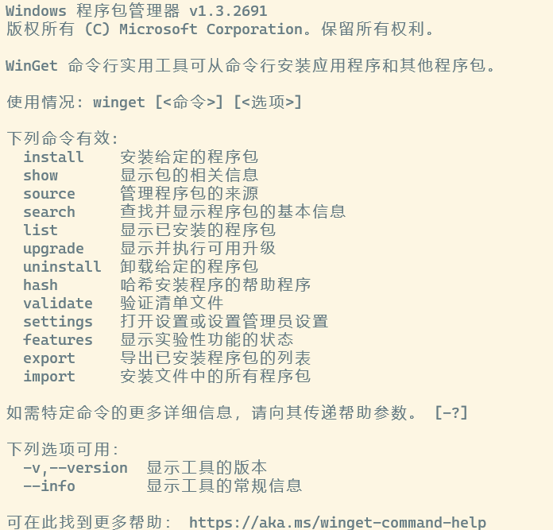
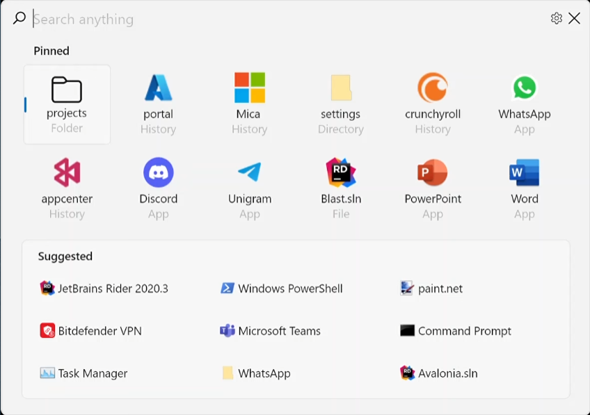

>工欲善其事，必先利其器。
*——《论语·卫灵公》*

## 前言

从事互联网技术开发多年以来，有一些软件总是会保留在电脑手机里。即使更换系统，这些软件也会被我第一时间下载回来。这些软件，不管是开发工具还是日常工具，都是我工作和生活中的利器。这些“利器”，不仅能让我更加专注于工作，还能让我更加专注于生活。所以这个系列文章，就是向大家介绍并推荐我所使用的“利器”。总体上来说以 Windows 平台上的开源、免费软件为主，并符合 Unix 哲学的简单原则：每个软件只解决一个问题，并且尽量做到最好。

## DesktopOK

[DesktopOK](https://www.softwareok.com/?seite=Freeware/DesktopOK) 是一个非常好用的桌面布局保存和恢复工具。它可以保存桌面图标的位置和布局，以便在下次登录时恢复。这个工具的使用非常简单，只需要将桌面图标布局调整到自己喜欢的样子，然后点击“保存”按钮即可。下次登录时，只需要点击“恢复”按钮，就可以恢复到上次保存的布局。推荐给经常在笔记本电脑上使用投影仪的用户。主要功能：

* 为每个屏幕分辨率保存您最喜欢的图标位置
* 有用的 Windows 桌面工具
* 轻松最小化屏幕上的所有窗口
* 自动保存桌面图标布局
* 最大化 Windows 桌面图标的数量
* 更改 Windows 桌面图标大小
* 自动隐藏和显示桌面图标

## WinGet

[WinGet](https://learn.microsoft.com/en-us/windows/package-manager/winget/) 是微软官方出品的 Windows 应用商店。它是一个命令行工具，可以用来安装、卸载、更新 Windows 应用。只需要在命令行中输入 `winget install <package>` 即可安装应用，输入 `winget uninstall <package>` 即可卸载应用。

这么多年，终于用上了 Win 系统下的包管理工具，还是蛮不错的。我主要用 WinGet 来安装编程相关的环境与套件，省去了搜索、下载与安装运行软件的一系列琐碎操作。需要注意的是，如果你要安装的应用有一个大众化的名字，比如 `git`，那么你需要在命令行中输入 `winget install git.git` 来安装。如果你不知道应用的包名，可以先用 `winget search <package>` 来搜索应用，然后再安装。

## QuickLook

[QuickLook](https://pooi.moe/QuickLook/) 是一个 Windows 平台上的文件预览工具。它可以在按下空格键时，快速预览文件。支持的文件类型有：图片、视频、音频、文本、PDF、Office、Markdown、HTML、代码等。它的使用非常简单，只需要按下空格键，就可以预览文件。推荐给经常需要预览文件的用户。主要功能：

* 支持预览多种文件类型
* 流畅的预览体验
* 触摸屏支持
* 在打开与保存对话框中预览文件
* 使用插件扩展功能

## TrafficMonitor

[TrafficMonitor](https://github.com/zhongyang219/TrafficMonitor) 是一个 Windows 平台上的流量监控工具。它可以在任务栏上显示当前的网络流量，以及 CPU、内存、硬盘等的使用情况。它的使用非常简单，只需要后台运行并显示到任务栏上即可。我用它来监测网络流量并查看当前所在城市的天气状况。主要功能：

* 显示当前实现网络传输速率、CPU 和内存占用率
* 如果电脑有多个网卡，支持自动和手动选择网络连接
* 查看网络详细信息
* 支持嵌入到任务栏显示
* 支持更换皮肤和自定义皮肤
* 历史流量统计
* 硬件信息监控
* 插件系统

## Fluent Search

[Fluent Search](https://fluentsearch.net/) 是一个 Windows 平台上的搜索工具。类似于 PowerToys 中的 PowerToys Run，用于快速搜索并在不同的应用与文件之间切换。它有一个杀手级功能：识别屏幕上的可点击元素并自动分配一个快捷键。适用于我这种不想记快捷键，双手在键盘上不想移开，摆脱鼠标实现快速切换应用与文件的懒人。主要功能：

* 搜索系统当前的活动进程
* 屏幕搜索
* 搜索文件并支持标签
* 搜索网页
* 自定义外观风格

## 结语

以上就是我这一期推荐的“利器”，如果你也有什么好用的软件，欢迎联系并给我建议，我们一起沧海拾遗，将更多的好用软件分享给大家。
