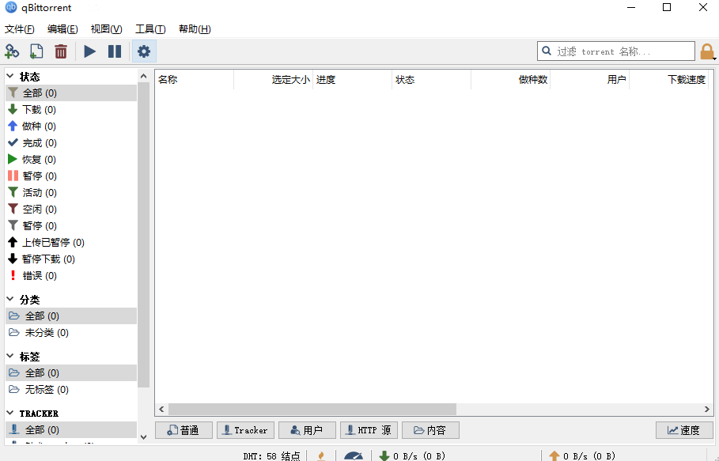
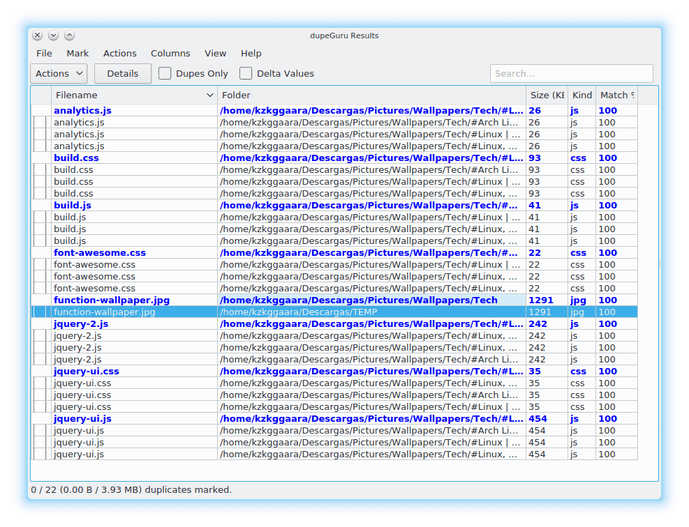
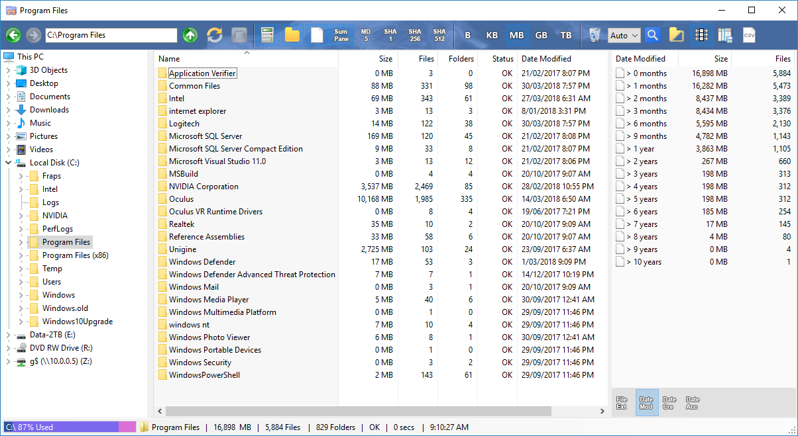
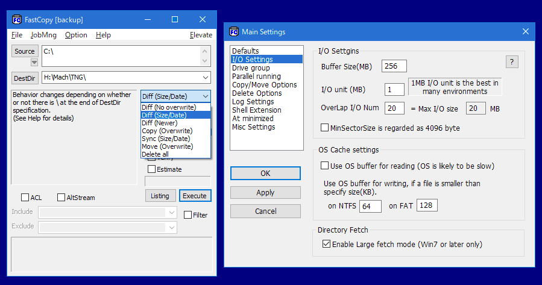

>工欲善其事，必先利其器。
*——《论语·卫灵公》*

## 前言

从事互联网技术开发多年以来，有一些软件总是会保留在电脑手机里。即使更换系统，这些软件也会被我第一时间下载回来。这些软件，不管是开发工具还是日常工具，都是我工作和生活中的利器。这些“利器”，不仅能让我更加专注于工作，还能让我更加专注于生活。所以这个系列文章，就是向大家介绍并推荐我所使用的“利器”。总体上来说以 Windows 平台上的开源、免费软件为主，并符合 Unix 哲学的简单原则：每个软件只解决一个问题，并且尽量做到最好。

## QBittorrent

[QBittorrent](https://www.qbittorrent.org/) 是一个开源的 BitTorrent 客户端。在当前国内的网络环境下，如果下载 BT 种子，推荐使用这个软件，它的界面简洁，功能强大，而且还是开源的。使用 QBittorrent 下载 BT 种子需要设置好 Trackers 服务器，可以在 [这里](https://github.com/XIU2/TrackersListCollection/blob/master/README-ZH.md) 找到一些可用的 Trackers 服务器。重要的是：**下载资源完成后保持做种使得分享率（上传数据大小 / 下载数据大小）至少为 1 以上，确保维持 BT 网络健康**。

还可以使用 [qBittorrent-Enhanced-Edition](https://github.com/c0re100/qBittorrent-Enhanced-Edition) 这个增强版本，它默认屏蔽了国内一众吸血 BT 下载软件并可以自动更新 Trackers 服务器。开箱即用，非常方便。 

## DupeGuru

[DupeGuru](https://dupeguru.voltaicideas.net/) 是一个开源的文件查重工具。它可以帮助我们快速查找重复的文件，从而节省磁盘空间。它的使用非常简单，只需要选择要查重的文件夹，然后点击 “Scan” 按钮，就可以查找出重复的文件。主要功能：

* 快速的模糊匹配算法，可在几分钟内找到您的重复文件
* 不仅能找到相同的文件名，还可以找到相似的文件名
* 可以扫描音乐标签，并在结果窗口中显示特定音乐的信息
* 模糊扫描图片，让你找到相似但不完全相同的图片
* 可定制，调整其匹配引擎以准确找到您想要查找的重复项类型

## FolderSizeExplorer

[FolderSizeExplorer](https://www.folder-size-explorer.com/index.shtml) （以下简称 FSE）是一个简单且免费的 Windows Explorer 软件，具有计算文件夹大小的附加功能。Microsoft 的内置 Windows 资源管理器不计算文件夹大小。当我们需要查看哪些文件夹占用了所有可用磁盘空间时，必须单独选择每个文件夹，然后单击属性以查看大小，一步步下来非常耗时。

FSE 会在浏览文件夹时逐步计算文件夹大小，快速查看哪些目录占用的磁盘空间最多。它还可以配置为计算显示的所有文件的 MD5、SHA1、SHA256 和 SHA512 校验和并将文件和文件夹列表保存为 CSV （Comma-separated values，逗号/字符分隔值文件）文件，以便在 Excel 和记事本等外部应用程序中查看。主要功能：

* 可将文件和文件夹列表导出并保存到 CSV 文件
* 浏览和导航文件时自动调整资源管理器列大小
* 根据文本、大小、日期等简单高效地搜索文件和文件夹
* 按扩展名、日期、月份和年份显示文件细分
* 多线程快速查看文件夹大小，能够即时跳过或取消任何文件夹

## FastCopy

[FastCopy](https://fastcopy.jp/en/) 是是 Windows 上最快的复制/备份软件。主要功能：

* 支持 UNICODE 和超过 MAX_PATH（260 个字符）的文件路径名
* 使用多线程，发挥出设备的最佳速度
* 像 UNIX 通配符一样支持包含/排除过滤器
* 它运行速度快，不占用资源（仅使用 Win32 API 和 C 运行时设计）

## Free Countdown Timer

[Free Countdown Timer](https://www.countdowntimer.net/) 是一个免费的倒计时软件，可以用来做计时器、闹钟、倒计时等。什么重要的日子即将到来？使用免费倒数计时器，再也不会忘记假期和纪念日了。主要功能：

* 支持多种计时器类型
* 设置置任意数量的倒数计时器
* 选择你喜欢的音乐播放并显示通知消息来提醒事件
* 使用文本字段标记便条，作为计时器用途的提醒
* 配置文件可以使用 USB 闪存设备快速同步

## 结语

以上就是我这一期推荐的“利器”，如果你也有什么好用的软件，欢迎联系并给我建议，我们一起沧海拾遗，将更多的好用软件分享给大家。
