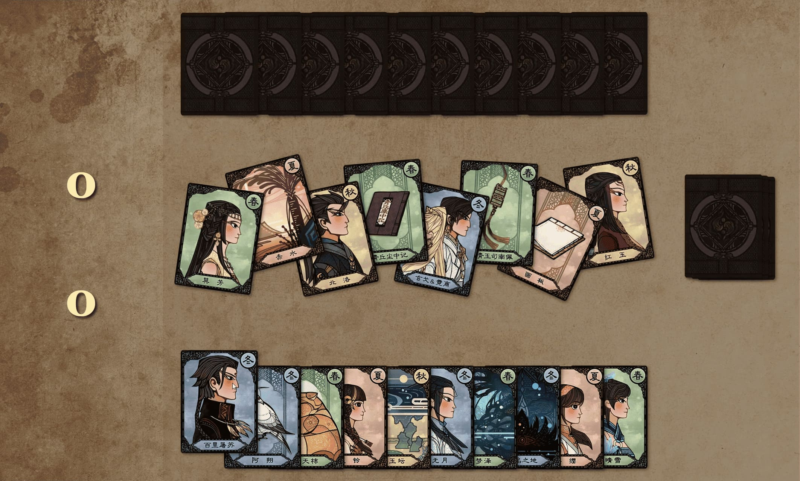

千秋戏是古剑三内置的类似日本花札玩法的卡牌小游戏。
游戏卡牌设置是我比较熟悉的第一代和第三代的人物组合，难度选择中等。
珍稀牌是一张天气姐，可以给百里屠苏增加分值。开局就抽到，真的是胡了。
游戏规则很简单：打出手牌拿取中央牌池相同季节的牌，形成组合算分，最后得分高者获胜。
基本策略就是多拿主角团的角色卡来形成搭配，后面珍稀牌多了，可以用来干扰对方。
看着一一幕幕的组合闪回，我又回到了当时玩游戏的快乐时光。

